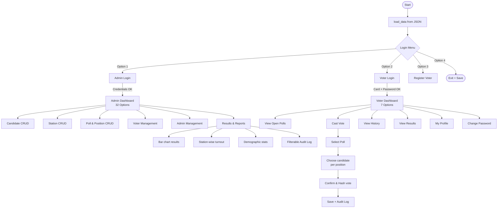
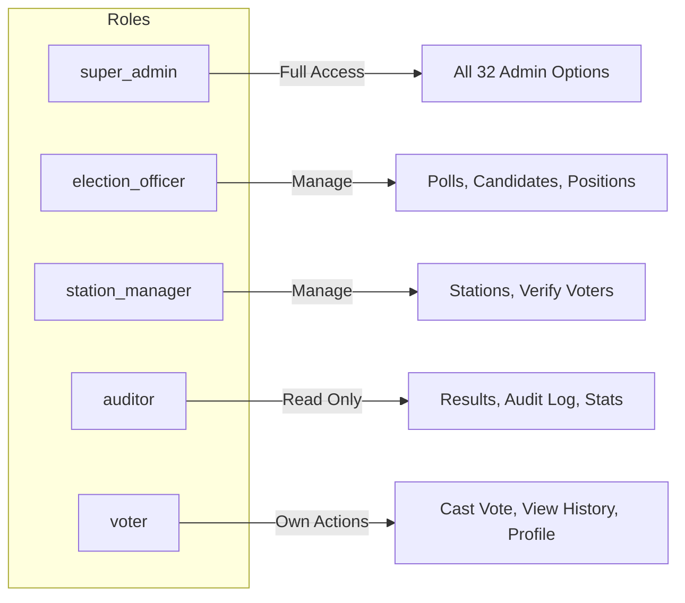
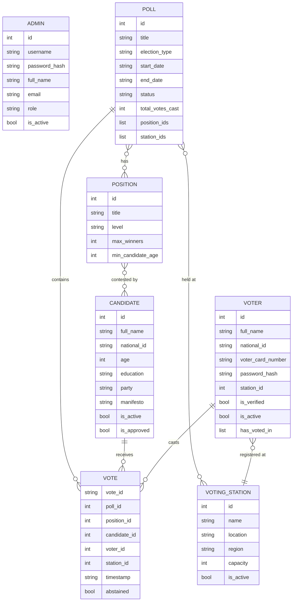

# 🗳️ National E-Voting Console Application

> **Uganda Christian University — Software Construction Easter 2026 | BsCS Year 3**
> 
> A fully-featured, terminal-based national e-voting system built in Python.
> Currently a monolithic application — the exam task is to refactor it into a **modular, object-oriented** Python project.

---

## 📁 Current File Structure

```
E-voting-App/
├── e_voting_console_app.py          # 1,633-line monolithic application (ALL logic in one file)
├── evoting_data.json                # JSON persistence file (auto-generated at runtime)
├── Software_construction_Easter_Test_2026.pdf  # Exam instructions
└── README.md                        # This file
```

---

## 🔍 Code Structure — Current Monolith

### Module Overview (all in `e_voting_console_app.py`)

```
e_voting_console_app.py
│
├── ── ANSI Color Constants (Lines 14–56)
│       Terminal color/style codes & theme aliases
│
├── ── UI Helper Functions (Lines 58–111)
│       colored(), header(), subheader(), table_header()
│       table_divider(), error(), success(), warning()
│       info(), menu_item(), status_badge(), prompt(), masked_input()
│
├── ── Global State / Data Store (Lines 163–193)
│       candidates, voting_stations, polls, positions
│       voters, admins, votes, audit_log
│       current_user, current_role
│       Constants: MIN_CANDIDATE_AGE, MAX_CANDIDATE_AGE, etc.
│
├── ── Utility Functions (Lines 195–252)
│       clear_screen(), pause()
│       generate_voter_card_number()
│       hash_password(), log_action()
│       save_data(), load_data()  → evoting_data.json
│
├── ── Authentication (Lines 254–430)
│       login()           → Admin or Voter login flow
│       register_voter()  → Self-registration with validation
│
├── ── Admin Dashboard (Lines 433–520)
│       admin_dashboard() → 32-option menu loop
│
├── ── Candidate CRUD (Lines 523–692)
│       create_candidate(), view_all_candidates()
│       update_candidate(), delete_candidate()
│       search_candidates()
│
├── ── Voting Station CRUD (Lines 695–794)
│       create_voting_station(), view_all_stations()
│       update_station(), delete_station()
│
├── ── Position CRUD (Lines 797–885)
│       create_position(), view_positions()
│       update_position(), delete_position()
│
├── ── Poll & Election CRUD (Lines 888–1090)
│       create_poll(), view_all_polls()
│       update_poll(), delete_poll()
│       open_close_poll(), assign_candidates_to_poll()
│
├── ── Voter Management (Admin) (Lines 1093–1179)
│       view_all_voters(), verify_voter()
│       deactivate_voter(), search_voters()
│
├── ── Admin Account Management (Lines 1182–1247)
│       create_admin(), view_admins(), deactivate_admin()
│
├── ── Voter Dashboard & Voting (Lines 1250–1443)
│       voter_dashboard()         → 7-option menu loop
│       view_open_polls_voter()
│       cast_vote()               → Full ballot flow with confirmation
│       view_voting_history()
│       view_closed_poll_results_voter()
│       view_voter_profile(), change_voter_password()
│
├── ── Results & Statistics (Lines 1446–1613)
│       view_poll_results()          → Bar chart results + turnout
│       view_detailed_statistics()   → Demographics, station load
│       station_wise_results()       → Per-station breakdown
│       view_audit_log()             → Filterable action log
│
└── ── Entry Point (Lines 1616–1633)
        main()  → load_data() → login loop → route to dashboard
```

---

## 🏗️ System Architecture — Current State

```
┌──────────────────────────────────────────────────────────────┐
│                  e_voting_console_app.py                     │
│                                                              │
│  ┌──────────┐  ┌──────────┐  ┌──────────┐  ┌───────────┐  │
│  │   UI     │  │  Logic   │  │   Data   │  │  State    │  │
│  │ (print/  │  │ (CRUD,   │  │ (JSON    │  │ (globals) │  │
│  │  input)  │  │  auth,   │  │  R/W)    │  │           │  │
│  │          │  │  voting) │  │          │  │           │  │
│  └────┬─────┘  └────┬─────┘  └────┬─────┘  └─────┬─────┘  │
│       │              │              │               │        │
│       └──────────────┴──────────────┴───────────────┘        │
│                    All mixed together ⚠️                      │
└──────────────────────────────────────────────────────────────┘
                             │
                             ▼
                    evoting_data.json
```

---

## 🔄 Application Flow



---

## 👥 Role & Access Model



---

## 🗄️ Data Model



---

## 📋 What the PDF Requires (Exam Task Breakdown)

### 🎯 Core Objective
> Refactor this **1,633-line monolith** into a **modular, object-oriented Python project**.  
> The application must behave **identically** after refactoring — same menus, same prompts, same outputs. **Do not add new features.**

---

### ✅ Principles to Apply

| # | Principle | What It Means for This Code |
|---|-----------|----------------------------|
| 1 | **Modular Design** | Split the single file into logical modules/packages (e.g. `models/`, `services/`, `ui/`, `utils/`) |
| 2 | **Object-Oriented Design** | Replace global dicts (candidates, voters, polls…) with proper **classes** — `Candidate`, `Voter`, `Poll`, `VotingStation`, `Vote` |
| 3 | **Separation of Concerns** | Separate the **UI layer** (menus/print/input), **business logic layer** (validation, rules), and **data layer** (persistence/JSON) |
| 4 | **Clean Code** | Better naming, no duplicated logic, small focused functions, consistent style |

---

### 📦 Suggested Refactored Project Structure

```
e_voting_app/
├── main.py                      # Entry point only
│
├── models/                      # Domain objects (OOP)
│   ├── __init__.py
│   ├── candidate.py             # Candidate class
│   ├── voter.py                 # Voter class
│   ├── admin.py                 # Admin class (with roles)
│   ├── poll.py                  # Poll + Position classes
│   ├── vote.py                  # Vote class
│   └── voting_station.py        # VotingStation class
│
├── services/                    # Business Logic Layer
│   ├── __init__.py
│   ├── auth_service.py          # Login, password hashing
│   ├── candidate_service.py     # Candidate CRUD + eligibility rules
│   ├── voter_service.py         # Voter CRUD + verification
│   ├── poll_service.py          # Poll lifecycle management
│   ├── vote_service.py          # Ballot casting + duplicate prevention
│   ├── station_service.py       # Station CRUD
│   └── report_service.py        # Results, statistics, audit log
│
├── ui/                          # Presentation Layer (menus, display)
│   ├── __init__.py
│   ├── colors.py                # ANSI color constants + helper functions
│   ├── admin_ui.py              # Admin dashboard menus
│   ├── voter_ui.py              # Voter dashboard menus
│   └── login_ui.py              # Login and registration screens
│
├── data/                        # Data Access Layer
│   ├── __init__.py
│   └── storage.py               # save_data() / load_data() → JSON
│
└── utils/                       # Shared utilities
    ├── __init__.py
    ├── validators.py            # Age, date, ID, email validation
    └── helpers.py               # generate_voter_card, log_action
```

---

### 🧠 Key Code Problems to Fix (Current Violations)

#### 1. Global Mutable State Everywhere
```python
# ❌ Current — raw global dicts mutated everywhere
candidates = {}
voters = {}
current_user = None

# ✅ Refactored — encapsulated in classes/services
class CandidateService:
    def __init__(self, storage: Storage):
        self._candidates: dict[int, Candidate] = {}
```

#### 2. UI + Logic Completely Mixed
```python
# ❌ Current — validation, print AND data change in same function
def create_candidate():
    full_name = prompt("Full Name: ")       # UI
    if age < MIN_CANDIDATE_AGE:             # Business logic
        error("Too young")                  # UI
    candidates[id] = {...}                  # Data layer
    save_data()                             # Data layer
```

#### 3. No Classes for Domain Objects
```python
# ❌ Current — candidates are plain dicts
candidates[1] = {"id": 1, "full_name": "...", "age": 30, ...}

# ✅ Refactored — proper class with encapsulation
@dataclass
class Candidate:
    id: int
    full_name: str
    age: int
    education: str
    party: str
    is_active: bool = True

    def is_eligible(self) -> bool:
        return (MIN_CANDIDATE_AGE <= self.age <= MAX_CANDIDATE_AGE
                and self.education in REQUIRED_EDUCATION_LEVELS
                and not self.has_criminal_record)
```

#### 4. 32-Option `if/elif` Chain in `admin_dashboard()`
```python
# ❌ Current — unmaintainable
if choice == "1": create_candidate()
elif choice == "2": view_all_candidates()
...
elif choice == "32": ...

# ✅ Refactored — dispatch table or command pattern
ADMIN_MENU = {
    "1": ("Create Candidate", candidate_service.create),
    "2": ("View Candidates", candidate_service.view_all),
    ...
}
```

#### 5. Duplicated Validation Logic
```python
# ❌ Age calculation duplicated in create_candidate() AND register_voter()
age = (datetime.datetime.now() - dob).days // 365

# ✅ Refactored — single utility function
# utils/validators.py
def calculate_age(dob_str: str) -> int:
    dob = datetime.strptime(dob_str, "%Y-%m-%d")
    return (datetime.now() - dob).days // 365
```

---

### 📊 Assessment Criteria (from PDF)

| Criterion | Weight | How to Score Full Marks |
|-----------|--------|------------------------|
| **Modular Structure** | 25% | Logical file separation, each file has a single responsibility |
| **Object-Oriented Design** | 20% | Proper classes, encapsulation, meaningful methods on objects |
| **Separation of Concerns** | 20% | UI, logic, and data layers fully decoupled and independent |
| **Clean Code Quality** | 15% | Clear naming, no duplication, small readable functions |
| **Working Application** | 10% | All original features still function after refactoring |
| **Report (this README)** | 10% | Clear explanation of structure and design decisions |

---

## 🚀 How to Run

```bash
# Run the current monolithic application
python3 e_voting_console_app.py

# Default admin credentials
Username: admin
Password: admin123
```

### Quick Start Workflow (as per exam instructions)
1. Login as `admin`
2. Create a Voting Station (menu option 6)
3. Create a Position (option 10) e.g. "President"
4. Create a Poll (option 14), assign the position
5. Create a Candidate (option 1)
6. Assign Candidate to Poll (option 19)
7. Open the Poll (option 18)
8. Logout → Register as Voter (option 3 on login screen)
9. Login as admin → Verify the voter (option 21)
10. Login as voter → Cast Vote (option 2)
11. Admin → View Poll Results (option 27)

---

## 🔒 Security Features

| Feature | Implementation |
|---------|---------------|
| Password Hashing | SHA-256 via `hashlib` |
| Masked Password Input | `tty`/`termios` on Linux, `msvcrt` on Windows |
| Vote Deduplication | `has_voted_in` list per voter + poll-station check |
| Vote Anonymity | Vote hash decouples voter identity from choice |
| Audit Logging | Every action timestamped with user + details |
| Account Deactivation | Soft-delete pattern (no hard deletes of voter/admin) |

---

## 🎓 Design Decisions to Document (for Report Section)

1. **Why separate `models/` from `services/`** — Models represent data structures (what things *are*); Services represent behaviours (what things *do*). This follows the Single Responsibility Principle.

2. **Why keep JSON persistence** — The exam says behaviour must be identical; switching to a DB would be a new feature. The `storage.py` module abstracts reads/writes so swapping later is easy.

3. **Why use `@dataclass` for models** — Reduces boilerplate, auto-generates `__init__`, works cleanly with JSON serialization.

4. **Why a `ui/` package** — The console display code (ANSI colours, menus, tables) is completely UI-specific. Decoupling it means the backend logic could be reused with a future web or GUI frontend.

5. **Why a `utils/validators.py`** — Validation rules (age, date format, ID uniqueness) appear in multiple places. Centralising them removes duplication and makes rule changes easier.

---

*Uganda Christian University | Faculty of Engineering, Design and Technology | Dept. of Computing and Technology*
